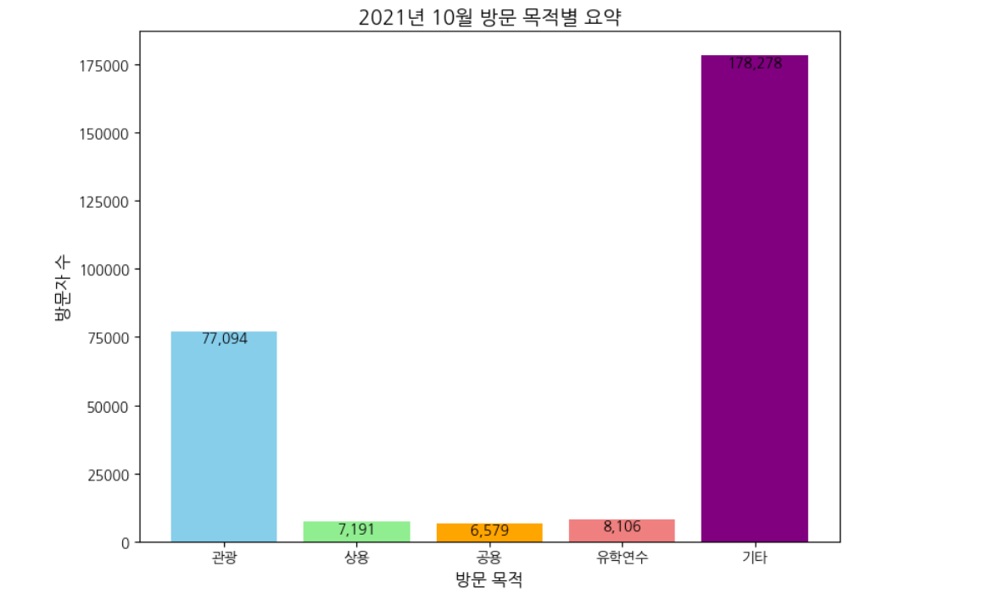
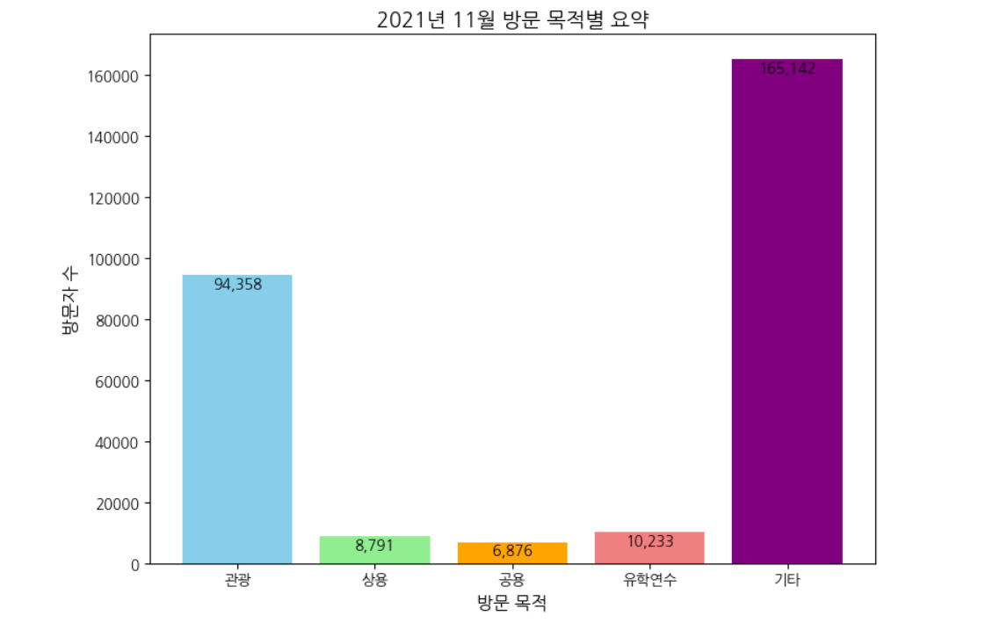

# 📊 공공데이터 기반 외래객 입국 목적 데이터 분석 프로젝트

**신구대학교 AI소프트웨어학과** '빅데이터 기초' 과제물로 수행된 프로젝트입니다. 2021년 하반기 공공데이터를 활용하여 코로나19 시기의 국가별·목적별 외래객 입국 현황을 분석하고 시각화하였습니다.

---

## 📌 프로젝트 개요
* **분석 목적**: 2021년 외래객 입국 데이터를 바탕으로 방문 목적(관광, 상용, 공용, 유학연수 등)을 분석하여 국가 및 대륙별 방문 특성을 파악합니다.
* **주요 기술**: `Python`, `Pandas`, `Matplotlib`, `Google Colab`
* **데이터 소스**: 한국관광공사 또는 공공데이터 포털의 외래객 입국 통계 데이터 (`데이터.xlsx`)

---

## 🛠 주요 처리 과정

### 1. 환경 설정 및 데이터 로드
* **한글 폰트 설정**: 시각화 시 한글 깨짐 방지를 위해 `나눔고딕(NanumGothic)` 설치 및 `Matplotlib` 환경 설정
* **데이터 수집**: `Pandas` 라이브러리를 활용하여 엑셀 데이터(`데이터.xlsx`) 로드

### 2. 데이터 전처리 (Data Cleaning)
* **데이터 정제**: 불필요한 행 제거 및 분석용 컬럼명 재설정 (대륙, 국적, 월, 방문자수)
* **데이터 구조 재구성**: `melt()` 함수를 활용하여 데이터 구조를 **Wide**에서 **Long format**으로 변환
* **타입 최적화**: 데이터 타입 변환 및 결측치 처리를 통한 데이터 무결성 확보

### 3. 데이터 시각화 (Visualization)
* **시점 분석**: 2021년 10월 및 11월 등 특정 시점의 입국 목적별 방문자수 집계
* **시각화 구현**: 바 차트(Bar Chart)를 생성하고, 데이터 레이블 및 컬러 설정을 통해 시각적 가독성 확보

---

## 📈 분석 결과 시각화 예시
분석 결과, 특정 달의 입국 목적 중 **'기타'**와 **'관광'**이 높은 비중을 차지하고 있음을 확인할 수 있었습니다. 상세 코드는 노트북 내 시각화 부분을 참조해 주세요.

* **2021년 10월 방문 목적별 요약 결과**

* **2021년 11월 방문 목적별 요약 결과**

---

## 📂 파일 구조
* `[신구대_빅데이터기초]_2021143018_김석윤.ipynb`: 데이터 분석 및 시각화 전체 소스 코드
* `데이터.xlsx`: 분석에 사용된 원본 데이터 파일 

---

## 🚀 실행 방법
1. **Google Colab** 환경에서 `.ipynb` 노트북 파일을 업로드하여 엽니다.
2. 분석에 필요한 `데이터.xlsx` 파일을 Google Drive의 해당 경로에 업로드하거나 실행 환경에 로드합니다.
3. 모든 코드 셀을 순차적으로 실행하여 분석 결과를 확인합니다.
